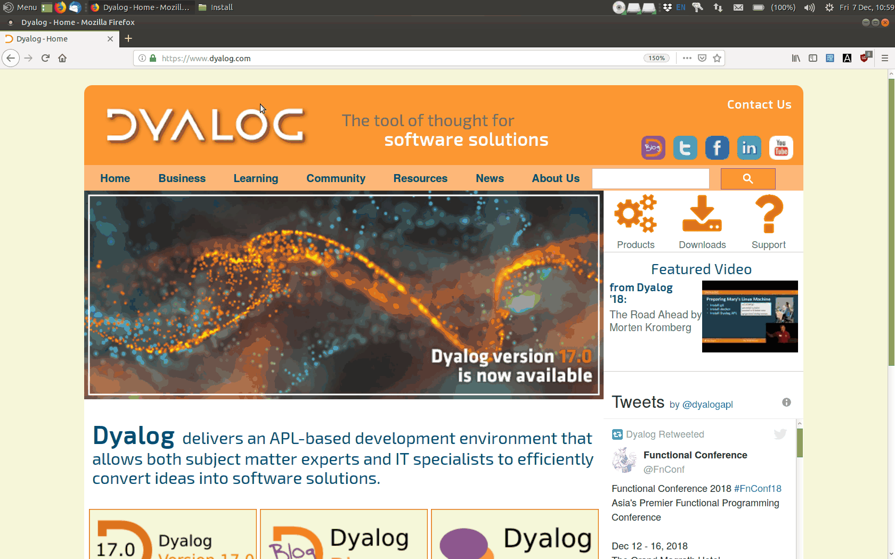

## Beginner's Guide to Dyalog APL

# QuickStart
1. Download [Dyalog APL](https://www.dyalog.com/download-zone.htm)  

  

2. Follow the instructions to install Dyalog for [MacOS](https://github.com/rikedyp/DyalogTutorials/wiki/Installation#install-dyalog-apl-for-macos), [Windows](https://github.com/rikedyp/DyalogTutorials/wiki/Installation#install-dyalog-apl-for-microsoft-windows) or [Linux](https://github.com/rikedyp/DyalogTutorials/wiki/Installation#install-dyalog-apl-for-linux)
3. Go to the [introduction](https://github.com/rikedyp/DyalogTutorials/wiki/First-Steps)
